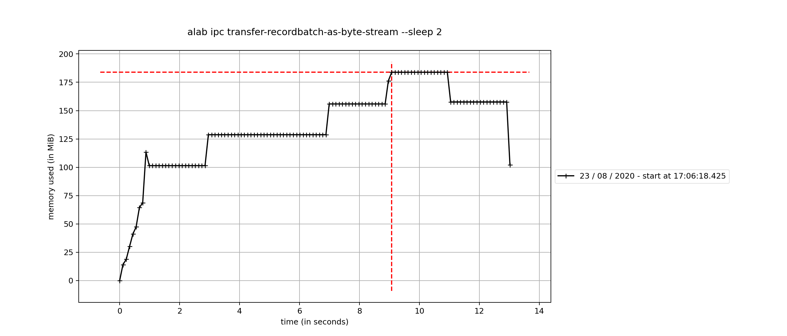
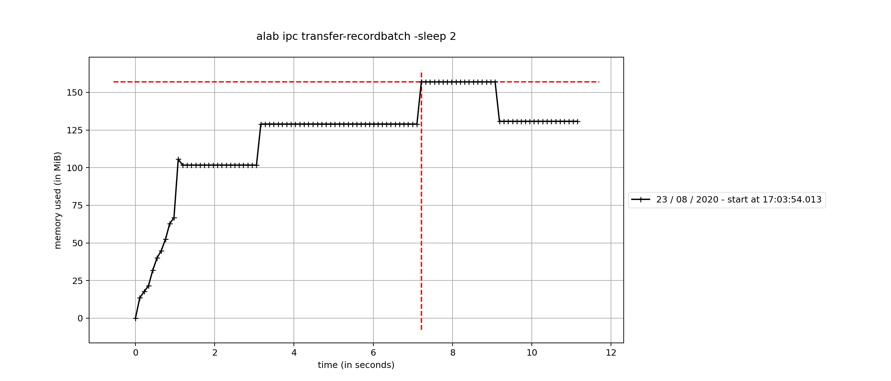
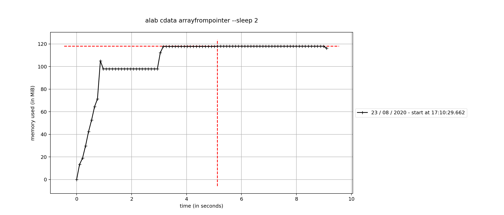

# Arrowlab
This repo contains a 4 different nonsens test setups
-   A tiny c project that provides a couple of different hard coded functions with return values. Used as examples when trying out rust ffi. 
-  A Rust project that is the "main" lab where we try a couple of different ways of getting arrow data from a python process.
- A tiny Cython project. It plays an intermediate part between rust and python by provides memory addresses.
- A python project that generates some arrow objects and tries to send those to a rust process. 

## Setup 

Ran these test on a macbook pro with:
-   Catalina 10.15.5
-   rustc 1.43.1 (8d69840ab 2020-05-04) (nightly)
-   Cython version 0.29.21
-   Python 3.8.1
-   SDKs/MacOSX.sdk/usr/include/c++/4.2.1 Apple clang version 11.0.3 (clang-1103.0.32.59) Target: x86_64-apple-darwin19.5.0

## BUILD AND RUN

The whole project is very sloppy. Everything needed for build and running the examples should be in the Makefile. It doesn't build everything into one solution. Rather relies on the different build outputs being present at different relative paths.


## LINKS ETC

### Compile and test c program
borrowed from https://overiq.com/c-programming-101/returning-a-pointer-from-a-function-in-c/
gcc -c c_test.c -o c_test -arch x86_64

### Py03
https://github.com/PyO3/pyo3
alab basic concat-string -s foo -s bar

### BINDGEN
https://rust-lang.github.io/rust-bindgen/command-line-usage.html
cargo install bindgen

### ARROW CFFI
This now works but had to manually import the cffi code from pyarrow 
(https://raw.githubusercontent.com/apache/arrow/master/python/pyarrow/cffi.py)

### ExportArrat (Cython)
Should be able to use ExportArray from https://github.com/apache/arrow/blob/master/cpp/src/arrow/c/bridge.cc


## The lab

### Background and caveat

There were two reasons for why I started playing around with the arrow interoperability between python and rust. 

Firstly I think the apache arrow project both look promising and interesting. Coming from a data background. I love the development of the file-based formats. How much that has simplified interoperability between applications. And it would be really nice see a similar development on the compute/memory side of things. 

Secondly I am trying to teach myself rust. I am a complete novice at both things.  Thus everything I write below could be completely wrong. Furthermore, I don't claim that any of this have any application in real life. But apart from practicing my writing skills. I also though it could be helpful for the other person. There should be about one more person trying to learn rust and being curious about arrow, right?

### Scope

The first aim was to get a sense of how python -> rust interoperability works. To see if we could get a zero copy transfer of objects. As i turned out the second part proved to be more difficult than anticipated. So I stopped when I've at least found a method of transferring a generic array. But before reaching a state where I had a full fledged example application. 

## Getting started - basic capabilities

To get started we'll need to basic capabilities. The first is quite obvious, we need to be able to call rust functions in python. The second is that we'll need to be able to interpret C objects in rust. The reason for the seconds part will be presented later on. 

### Calling rust functions from python - Pyo3 

There is a brilliant crate called [pyo3](https://github.com/PyO3/pyo3). That will provide all the capabilities we need and more. This lab is only sending addresses and strings back and forth but it contains a lot more features. 
There are macros to define python modules. There is a single macro to expose one of your functions as a python function. 
The arguments can be native primitive types when implementing rust functions. But the return value needs to be a pyo3 type. 
One little gotcha is that the macros seem to need your python modules functions to be defined in the same rust module. And to get your python module available in python they need to be in the rust lib file. 

### Interpreting c objects in rust

There is multiple crates that include fancier functionality for interoperability with "c-like" code. The type definitions should probably made use of something like [libc](https://crates.io/crates/libc). But it is only pointer addresses that is being shared in this lab. And that simply works with normal rust types since they have the same memory layout. We can also get structs directly from c functions. We only need to annotate our rust structs to have a c-like memory outline ([repr(c)]).

There is a couple of examples included in main.rs. Running `make install_rust_binary`installs the rust examples. 
``` bash
$ arrowlab get-struct
Getting a simple struct pointer with three ints x,y,z from c, the values should be 666,7727,2
The result: TestStruct { x: 666, y: 7727, z: 2 } 
```

### Possibilites

The arrow project has a module for inter process communication ([IPC](https://arrow.apache.org/docs/format/Columnar.html#serialization-and-interprocess-communication-ipc)). That allows transfer of high level objects out of the box and is supported by both python and rust. 
It also has the flight module for RPC call that could be used for the same purpose. Even though it's perhaps more interesting it isn't covered here. 
Since some time back it also has something called [c data interface](https://arrow.apache.org/docs/format/CDataInterface.html). That is a spec for interoperability. 

#### IPC 

The ipc modules are really easy to use both in python and rust. You can both read and write high level objects such as a recordbatch in both languages. 
In the following python snippet. A parquet file is read into a pyArrow table. That is thereafter split into a list of RecordBatches. Those are the written to a IPC BufferOutputStream. That works beautifully. 

``` Python 
    a = pq.read_table(file_name)
    print("read data, we have now instatiated the data once")
    batches = a.to_batches(max_chunksize=9999999999) 

    print(f"created {len(batches)} batches, second time we instatiate the data")
    sink = pa.BufferOutputStream()
    writer = pa.ipc.new_stream(sink, batches[0].schema)
    for batch in batches:
        writer.write_batch(batch)
    print("wrote batches, third instanciation")
    writer.close()
    return sink.getvalue(
```

The only problem with this approach is that it will introduce an additional copy of the data. The step where the batches are written to the stream. 

To get the data to rust we can simply convert the output stream to a python byte array. The output stream has a method called to_pybytes. The bytearray can be directly passed to rust as a primitive type. That works but it creates two more instatiations of the data. We can avoid this getting the memory address for the output stream by it's property address. And send that int over to rust instead. That avoids to the two extra copies. The drawback is that our rust-function that dereference the pointer will be unsafe. 

The rust code to convert it back to rust arrow objects: 
```Python
mprof run --include-children alab ipc transfer-recordbatch -sleep 10
mprof plot
``` Rust
/**************************************************
 * IPC
 **************************************************/
fn read_recordbatch_from_streamreader(
    sr: Result<StreamReader<&[u8]>>,
    sleep: u64,
) -> Vec<RecordBatch> {
    let mut batches: Vec<RecordBatch> = vec![];
    match sr {
        Ok(mut e) => {
            let mut res: String = "".to_owned();

            while (!e.is_finished()) {
                match e.next_batch() {
                    Ok(v) => match v {
                        Some(x) => {
                            let mut r: RecordBatch = x.into();
                            batches.push(r);
                        }
                        None => (),
                    },
                    Err(f) => panic!("Error reading record batch"),
                };
            }
            if sleep > 0 {
                println!("going to sleep for {} seconds in read_recordbatch", sleep);
                crate::sleep_int(sleep);
            }
            batches
        }
        Err(f) => panic!("Failed to get Streamreader"),
    }
}

/// A function that reads recordbatches from a memory addresss pointing to an ipc stream.
/// The we just read the batches schema into a variable that gets printed.
#[pyfunction]
fn read_recordbatch(buf_address: i64, size: usize, sleep: u64) -> PyResult<String> {
    let buf_ref = unsafe { slice::from_raw_parts(buf_address as *const u8, size) };
    let sr = StreamReader::try_new(buf_ref);
    let mut batches: Vec<RecordBatch> = read_recordbatch_from_streamreader(sr, sleep);
    Ok(batches[0].schema().to_json().to_string())
}
```

The following images illustrates the memory usage. The timeline is simply nonsens. I've added 10 seconds sleeps to make images easier to interpret. To run one of the examples and generate the plot: 

##### Byte array



##### From pointer



#### C DATA INTERFACE 

As far as I understand the rust implementation could implement the same array structure as the c++ implementation.  And we would be good to go but it doesn't (probably for good reasons). Nor does it implement a structure as the c data interface. Nor the the ability to convert and array on the c data interface structure to a rust arrow array. This is one part where I might very possibly be very wrong. 

In this lab, I just completed a POC to give myself a sense of what implementing the conversion would mean. 
The structures in the d data interface defines both a schema and a data struct. This solution handles only the data struct. It contains no generic mapping from the c data interface structure to the Rust implementation. Instead we test the transfer by only handle the data struct for a simple float array. 

##### Getting the c data struct

Our first obstacle to get through is that we need to convert the python arrow array to the basic c-structure. There is a _export_to_c method on the pyarrow array. That accepts a couple of arguments in the form of pointers to a data and a schema structs. So we need to create those structs; a few lines of cython (see cython-code.unwrap in the project). 

```` Python
def get_array(obj):
    c_schema = ffi.new("struct ArrowSchema*")
    ptr_schema = int(ffi.cast("uintptr_t", c_schema))
    c_array = ffi.new("struct ArrowArray*")
    ptr_array = int(ffi.cast("uintptr_t", c_array))
    obj._export_to_c(ptr_array, ptr_schema)
    return ptr_array
````

##### Creating a rust array

We already know how to get those c-objects into rust. We'll define corresponding structures and dereference the raw pointer. 

```` Rust
#[repr(C)] 
#[derive(Debug)]
pub struct ArrowArray {
    pub length: i64,
    pub null_count: cty::int64_t,
    pub offset: cty::int64_t,
    pub n_buffers: cty::int64_t,
    pub n_children: cty::int64_t,
    pub buffers: cty::int64_t,
    pub children: cty::int64_t,
    pub dictionary: cty::int64_t,
}
````

The repr(C) annotation provides us with a struct that has a c-like memory alignment. If we would implement the schema as well we could create a generic mapper to rust arrow arrays. In the example of transferring a float array. We only need a subset of the data-points. 
The children and dictionary are only applicable for more complex array types. 
The code below is a slightly shorthen version. The derive bufferdefinitions hack is to solve for the rust arrow buffers having memory alignment checks.  the checks enforces 128 bit memory alignment on the buffers for x86_64. The c arrays are 64 bit aligned on my system. We work around that by manipulating the address and offset synchronously. The first buffer is always the null bitmap that should be zero here. Hence we are only considering the first. 

``` Rust
    let arrow_array_ptr = address as *const ArrowArray;
    let mut res = "".to_string();
    unsafe {
        let arrow_array = arrow_array_ptr.read();
        //The primitive array should have 2 buffers, the null bitmap and the value buffer
        //This a hack to handle the memory alignement check in the rust code, line 181 in Buffers.rs
        let buffer_defs =
            derive_bufferdefinitions(arrow_array.buffers, arrow_array.n_buffers as usize);
        let buffer =
            Buffer::from_unowned(buffer_defs[1].address as *const u8, 0 as usize, 0 as usize);
        let primitiv_int32_array = Float64Array::new(
            arrow_array.length as usize,
            buffer,
            arrow_array.null_count as usize,
            (arrow_array.offset as usize) + buffer_defs[1].offset,
        );
```
Implementing the generic version should provide us with a zero-copy version of python -> rust arrow array transfer. 
running `mprof run --include-children alab cdata arrowfrompointer -sleep 10` provides the memory graph below. 

